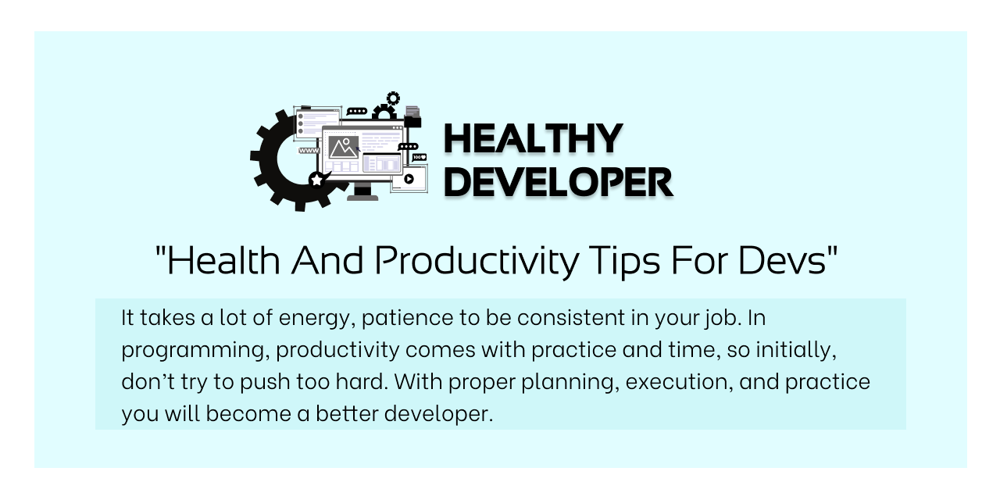

# 
Healthy-developer

## A Healthy website that every developer must take tips from.

### Introduction
Let's face it. As developers, It's easy to let things get a bit out of hand health-wise. Many times we find ourselves in front of screens for hours on end. We sleep really late (or not at all) sometimes. Unless you're disciplined enough to follow a schedule, you might find yourself not having time to eat proper meals so snacking becomes a habit. These are all sacrifices usually made to fix a bug or find the most efficient solution to a problem. Usually our health has to bear the brunt of this.

We think, If healthier practices were adopted, developers would be much more productive and would be able to accomplish some tasks in less time simply because the brain is much clearer.

<ul>
<li>Quit eating lunch at your desk.</li>
<li>Use meal planning to boost your nutrition.</li>
<li>Drink sufficient water.</li>
<li>Do Exercise daily for better productivity.</li>
<li>Practice self care to improve mental health.</li>
<li>Take screen break to decrease tension and reduce eye strain.</li>
</ul>

### This website contains all the goodies and tips that makes a developer healthy wealthy and wise ;)
### Health to productivity tips used by senior developers.
## Open Sourced !! So start contributing this hacktober!!
## Start your open source contributions while you also get to learn good habits as an early developer. All the best Devs :)

<h3>Made with &#10084; by Open Source Team</h3>

